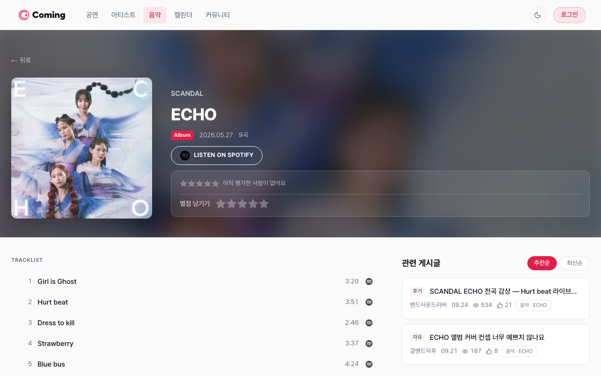
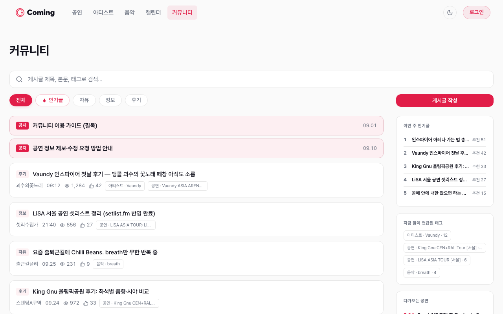
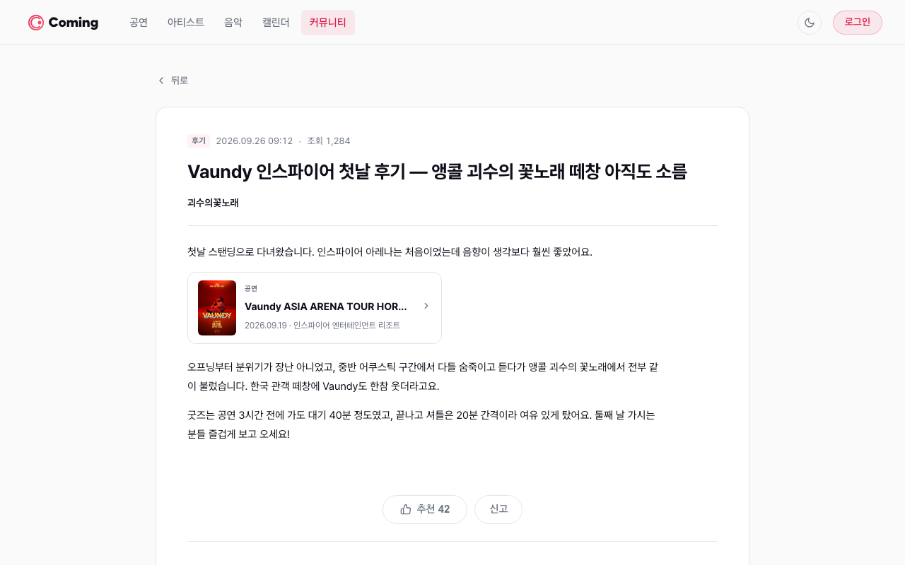
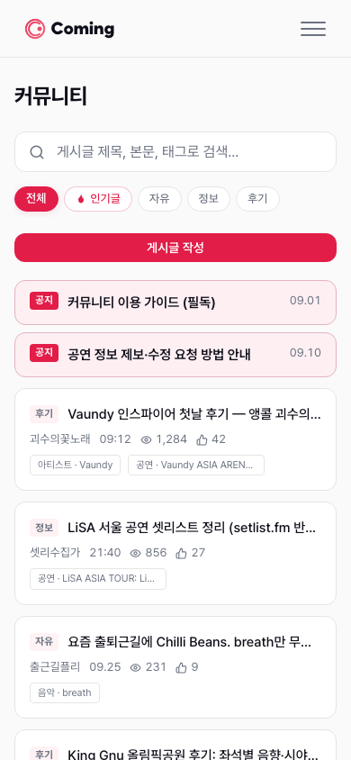

<div align="center">
  

  <br />
  <br />

  **Jpop 아티스트 내한 공연 정보 통합 플랫폼**

  KOPIS · MusicBrainz · setlist.fm 데이터를 연동한 내한 공연 정보 서비스

  <br />

  [](https://react.dev/)
  [](https://vitejs.dev/)
  [](https://tanstack.com/query)
  [](https://zustand-demo.pmnd.rs/)
  [](LICENSE)

  <br />

  **[→ comingg.com](https://comingg.com)**

</div>

---

## 서비스 소개

**Coming**은 Jpop 아티스트의 국내 내한 공연 정보를 한눈에 확인할 수 있는 웹 플랫폼입니다.

공연 일정 탐색부터 아티스트 팔로우, 캘린더 뷰, 팬 커뮤니티까지 — 흩어진 내한 공연 정보를 한 곳에서.

<br />

<div align="center">
  
  <p><sub>홈 — 인기 공연 · 티켓팅 일정 · 다가오는 공연 · 새 앨범·싱글 · 관심 아티스트 공연</sub></p>
</div>

<table>
  <tr>
    <td align="center" width="50%">
      
      <sub><b>공연 목록</b> — 내한 공연 검색 및 필터</sub>
    </td>
    <td align="center" width="50%">
      
      <sub><b>공연 상세</b> — 공연 정보 · 티켓팅 · 가격 · 평점 · 예매처</sub>
    </td>
  </tr>
  <tr>
    <td align="center" width="50%">
      
      <sub><b>아티스트 목록</b> — 아티스트 탐색 및 팔로우</sub>
    </td>
    <td align="center" width="50%">
      
      <sub><b>아티스트 상세</b> — 팔로우 · Spotify · 소셜 링크 · 디스코그래피</sub>
    </td>
  </tr>
  <tr>
    <td align="center" width="50%">
      
      <sub><b>음악 목록</b> — 앨범·싱글 릴리즈 탐색</sub>
    </td>
    <td align="center" width="50%">
      
      <sub><b>음악 상세</b> — 수록곡 · Spotify · 평점 · 관련 게시글</sub>
    </td>
  </tr>
  <tr>
    <td align="center" width="50%">
      
      <sub><b>커뮤니티</b> — 게시글 · 공지 · 인기글 · 많이 언급된 태그</sub>
    </td>
    <td align="center" width="50%">
      
      <sub><b>게시글 상세</b> — 공연·아티스트·음악 멘션 카드 · 추천 · 신고</sub>
    </td>
  </tr>
  <tr>
    <td align="center" colspan="2">
      
      <br /><sub><b>캘린더</b> — 월별 공연·티켓팅 일정 뷰</sub>
    </td>
  </tr>
</table>

<sub>※ 커뮤니티·게시글 상세 화면과 음악 상세의 관련 게시글은 스크린샷용 샘플 데이터입니다.</sub>

<br />

<details>
<summary>📱 모바일 화면 보기</summary>
<br />
<table>
  <tr>
    <td align="center">
      
      <br /><sub><b>홈</b></sub>
    </td>
    <td align="center">
      
      <br /><sub><b>공연 목록</b></sub>
    </td>
    <td align="center">
      
      <br /><sub><b>커뮤니티</b></sub>
    </td>
  </tr>
</table>
</details>

---

## 주요 기능

- 🎤 **아티스트** — MusicBrainz 연동 아티스트 프로필, 소셜 링크, 관련 공연 및 음반 정보
- 🎵 **공연** — KOPIS 기반 내한 공연 목록, 상세 정보·출연 아티스트·예매처, setlist.fm 셋리스트
- 📅 **캘린더** — 월별 공연 일정을 한눈에 확인
- 💿 **음악** — 아티스트 음반 릴리즈 정보, 수록곡 및 Spotify 바로가기
- ⭐ **평점** — 공연·음반 별점 평가
- 💬 **커뮤니티** — 게시글·댓글, 아티스트·공연 멘션 에디터, 공지사항, 신고
- 🔔 **팔로우** — 관심 아티스트 팔로우 및 마이페이지 관리 (예정·다녀온 공연, 1:1 문의)
- 🌙 **다크 모드** — 시스템 설정 연동 + 수동 전환
- 🔐 **소셜 로그인** — Google · Kakao OAuth 2.0

---

## 페이지 구성

| 페이지 | 경로 | 설명 |
|--------|------|------|
| 홈 | `/` | 메인 페이지 |
| 아티스트 목록 | `/artists` | Jpop 아티스트 목록 및 검색 |
| 아티스트 상세 | `/artists/:id` | 프로필, 관련 공연·음반 |
| 공연 목록 | `/concerts` | 내한 공연 목록 및 필터 |
| 공연 상세 | `/concerts/:id` | 공연 정보, 장소, 출연진, 셋리스트, 평점 |
| 음악 목록 | `/releases` | 음반 릴리즈 목록 |
| 음악 상세 | `/releases/:id` | 음반 상세, 수록곡, 평점 |
| 캘린더 | `/calendar` | 월별 공연 일정 뷰 |
| 커뮤니티 | `/community` | 게시글 목록, 고정 공지, 인기글·태그 사이드바 |
| 게시글 상세 | `/community/:id` | 게시글 본문, 댓글, 관련 글 |
| 글쓰기·수정 | `/community/write`, `/community/:id/edit` | 게시글 에디터 _(로그인 필요)_ |
| 공지 상세 | `/community/notices/:id` | 공지사항 |
| 회원가입 | `/signup` | 소셜 로그인 후 닉네임 설정·약관 동의 |
| 약관 | `/terms`, `/privacy` | 서비스 이용약관, 개인정보처리방침 |
| 마이페이지 | `/me/*` | 관심 아티스트, 예정·다녀온 공연, 내 문의, 설정 _(로그인 필요)_ |
| 관리자 | `/admin/*` | 공연·아티스트 데이터, 승인 대기·제외 공연, 문의, 신고, 공지, 약관 관리 _(관리자 전용)_ |

---

## 기술 스택

| 분류 | 기술 |
|------|------|
| 프레임워크 | React 19, Vite 8 |
| 라우팅 | React Router v7 |
| 서버 상태 | TanStack Query v5 |
| 클라이언트 상태 | Zustand v5 |
| HTTP 통신 | Axios (인터셉터 중앙화, 자동 토큰 갱신) |
| 스타일 | CSS Modules |
| 에디터 | Tiptap v3 |
| 날짜 | date-fns, react-datepicker |
| 테스트 | Vitest, React Testing Library |
| 분석 | Vercel Analytics, Speed Insights |

---

## 시작하기

### 요구 사항

- Node.js 22.12+ (Vitest 요구 사항)
- npm 10+

### 설치

```bash
git clone https://github.com/Cominggg/Frontend.git
cd Frontend
npm install
```

### 환경 변수

프로젝트 루트에 `.env` 파일을 생성합니다.

```env
VITE_API_BASE_URL=http://localhost:8080
```

> 개발 서버는 `/api/**` 경로를 자동으로 백엔드로 프록시합니다 (CORS 설정 불필요).

### 개발 서버 실행

```bash
npm run dev
```

`http://localhost:5173` 에서 확인할 수 있습니다.

---

## 명령어

```bash
npm run dev       # 개발 서버 시작
npm run build     # 프로덕션 빌드 (prebuild에서 sitemap.xml 생성)
npm run preview   # 빌드 결과 미리보기
npm run lint      # ESLint 실행
npm run test      # Vitest 1회 실행
npm run test:watch  # Vitest watch 모드
```

---

## 프로젝트 구조

```
src/
├── pages/              # 라우트 단위 페이지
│   ├── admin/          # 관리자 전용 (AdminRoute 보호)
│   └── ...
├── components/         # 도메인별 컴포넌트
│   ├── artist/         # 아티스트 카드, 별칭, 공연 아이템
│   ├── concert/        # 공연 카드, 아티스트 추가 모달
│   ├── release/        # 음반 카드
│   ├── calendar/       # 캘린더 그리드, 일별 공연 목록
│   ├── post/           # 게시글 목록·본문, 댓글, 에디터(Tiptap), 사이드바, 신고 모달
│   ├── rating/         # 공연·음반 평점
│   ├── auth/           # 로그인 모달
│   ├── layout/         # 헤더, 푸터, PrivateRoute, AdminRoute
│   └── ui/             # 공통 UI (Badge, Pagination, EmptyState 등)
├── services/           # 도메인별 API 함수 (Axios 인스턴스 기반)
├── stores/             # Zustand 스토어 (auth, loginModal, theme)
├── hooks/              # 공통 훅 (모달 접근성, 가로 스크롤, 페이지 메타)
├── constants/          # 라우트 경로 등 상수
├── utils/              # 날짜·Spotify·구조화 데이터 등 유틸
└── test/               # 테스트 공통 setup
```

테스트 파일은 대상 파일 옆에 `*.test.js(x)`로 둡니다.

---

## 인증 구조

- **소셜 로그인**: Google, Kakao OAuth 2.0
- **Access Token**: Authorization 헤더로 전송
- **Refresh Token**: HttpOnly Cookie로 자동 전송
- **자동 갱신**: 401 응답 시 Axios 인터셉터에서 자동으로 토큰 갱신
- **비로그인 보호**: 보호 기능 접근 시 페이지 이동 없이 로그인 모달 표시

---

## AI 협업 워크플로우

Claude Code 에이전트·스킬·훅으로 이슈부터 PR까지 진행합니다. 프로젝트 규칙은 [`CLAUDE.md`](CLAUDE.md)에 모여 있고, 아래 도구들이 그 규칙을 역할별로 나눠 강제합니다.

### 흐름

```
/issue → /plan-issue → (web-design) → 구현 → write-tests → npm run test → /fe-review → /simplify → /commit → /pr
```

| 단계 | 도구 | 하는 일 |
|------|------|--------|
| 이슈·브랜치 | `/issue` | GitHub 이슈 생성 + `{type}/#{번호}-...` 브랜치 체크아웃 |
| 계획 | `/plan-issue` | 이슈 체크리스트를 코드 현황과 대조하고, 남은 작업을 커밋 단위로 순서화 (API 함수 → 상태 → 컴포넌트, `ui`/`feat` 분리) |
| 디자인 검토 | `web-design` 에이전트 | 화면·UX 판단이 필요한 작업만 구현 전에 검토 — 디자인 토큰·기존 `ui/` 컴포넌트 기준 구현안 제시 |
| 구현 | 메인 세션 | 페이지·컴포넌트 단위 구현 |
| 테스트 작성 | `write-tests` 에이전트 | 유틸·훅·스토어·컴포넌트 옆에 `*.test.js(x)` 작성 (Vitest + React Testing Library) |
| 테스트 실행 | `npm run test` | 전체 테스트 실행 — 통과해야 리뷰 단계로 진행 |
| 리뷰 | `/fe-review` | 프로젝트 규칙 위반 검토 — 🔴 critical 0건이어야 커밋 |
| 정리 | `/simplify` | 변경 코드의 중복·불필요한 복잡도 정리 |
| 커밋·PR | `/commit`, `/pr` | 컨벤션(`[{type}] 요약`)에 맞춘 커밋·PR 작성 |

`fe-review` 스킬과 두 에이전트는 이 레포의 [`.claude/`](.claude/)에 포함돼 있습니다. `/issue`, `/plan-issue`, `/commit`, `/pr`은 작성자의 전역 Claude Code 스킬이고 `/simplify`는 Claude Code 기본 스킬이라 레포에는 없습니다.

### 에이전트 역할 분리와 병렬 실행

| 에이전트 | 역할 | 수정 범위 |
|---------|------|----------|
| [`write-tests`](.claude/agents/write-tests.md) | 테스트 작성, 테스트 컨벤션(파일 위치·쿼리 우선순위·API 모킹 방식)의 기준 문서 | `*.test.js(x)`, `src/test/` — 테스트를 통과시키려고 구현 코드를 고치지 않고, 버그로 보이면 보고만 한다 |
| [`web-design`](.claude/agents/web-design.md) | 디자인·UX 검토, 신규 기능의 FE 구현 범위 검토 | 코드 대신 진단·구현안(토큰·CSS Modules 코드·breakpoint별 레이아웃)을 제시 |

`write-tests`는 테스트 대상이 서로 독립적일 때 병렬로 실행합니다.

- 서로 import하지 않는 대상이 **3개 이상**이면 단일 응답에서 병렬 호출하고, 1~2개면 순차 작성한다 (에이전트 cold start 비용이 시간 이득보다 크기 때문)
- 호출 전에 `vite.config.js`의 `test` 블록과 기존 테스트 예제 1개를 프롬프트에 넣어 에이전트의 중복 탐색을 줄인다
- 스토어·훅 → 이를 쓰는 컴포넌트 순서는 유지한다 (컴포넌트 테스트가 스토어·훅 계약을 전제)

스타일·반응형 전용 변경(`ui` 커밋)은 테스트 대상이 아니며 브라우저에서 직접 확인합니다.

### 코드 리뷰 (`/fe-review`)

[체크리스트](.claude/skills/fe-review/references/fe-checklist.md)는 test·lint 자동 검사와 diff 기반 수동 검토로 나뉩니다. 이번 변경에서 추가·수정된 라인만 판정하고, 기존 코드의 위반·lint 에러는 결과에서 제외합니다.

- **반응형**: breakpoint는 `767px`·`900px`·`1279px`만 허용 — `480px` 등 비표준 값은 critical
- **스타일**: `Xxx.jsx` + `Xxx.module.css` 페어링, 전역 CSS import 금지, 색상은 `index.css` 토큰 사용 (리터럴은 다크 모드에서 전환되지 않음)
- **목 데이터**: `MOCK_*_MAP` + `// TODO: API 연동 후 제거` 표기, API 연동 후 잔존 여부
- **인증·권한**: 비로그인 보호 기능은 페이지 이동이 아닌 로그인 모달(현재 URL 유지), 관리자 경로는 `AdminRoute`, 토큰을 Web Storage에 저장 금지
- **API·상태**: `axios` 직접 호출 금지(`services/api.js` 인스턴스 경유), 서버 상태는 React Query, 경로는 `ROUTES` 상수
- **접근성**: 클릭 가능한 `div`, `alt`·`aria-label` 누락, 모달 포커스 트랩(`useModalA11y`), 터치 영역 44px

체크리스트는 도입 시 의도적인 위반(`480px`, redirect 누락)을 심은 diff로 검출 여부를 확인한 뒤 확정했습니다.

### 훅 ([`.claude/settings.json`](.claude/settings.json))

| 시점 | 대상 | 동작 |
|------|------|------|
| PreToolUse | Write·Edit·MultiEdit | 파일명이 `.env`·`.env.*`이거나 `credentials`·`.secret`을 포함하면 수정 차단 (`.env.example`은 커밋 대상 템플릿이라 허용) |
| Stop | 레포 루트 | Playwright로 화면 확인 중 남은 임시 스크린샷(`*.png`·`*.jpg`) 정리 |

---

## 관련 레포지토리

| 레포 | 설명 |
|------|------|
| [Backend](https://github.com/Cominggg/Backend) | Spring Boot 4.x 백엔드 |
| [Data](https://github.com/Cominggg/Data) | Python 데이터 파이프라인 (KOPIS·MusicBrainz·setlist.fm) |
| [Specification](https://github.com/Cominggg/Specification) | ERD, API 명세, 인증 정책 |

---

## License

[MIT](LICENSE) © 2026 Cominggg
