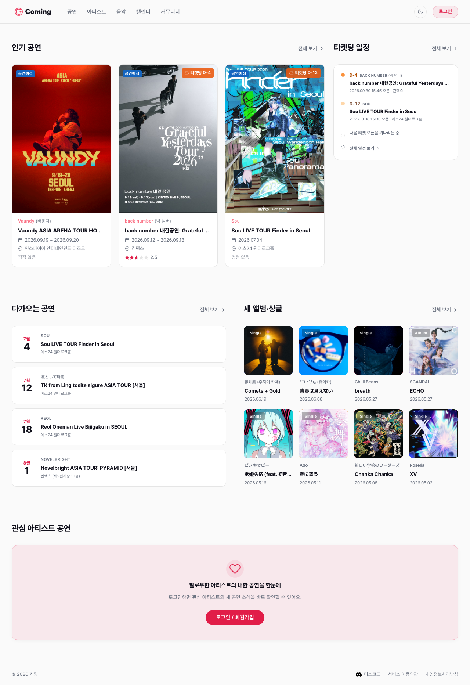
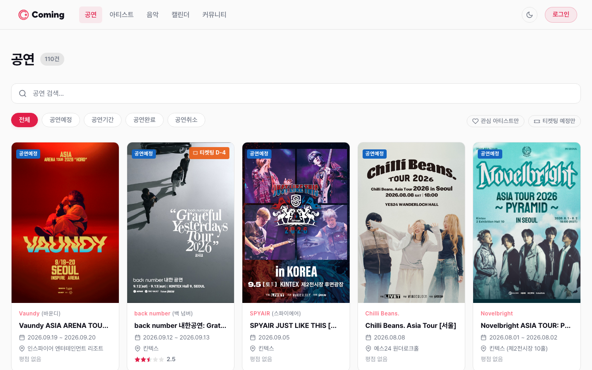
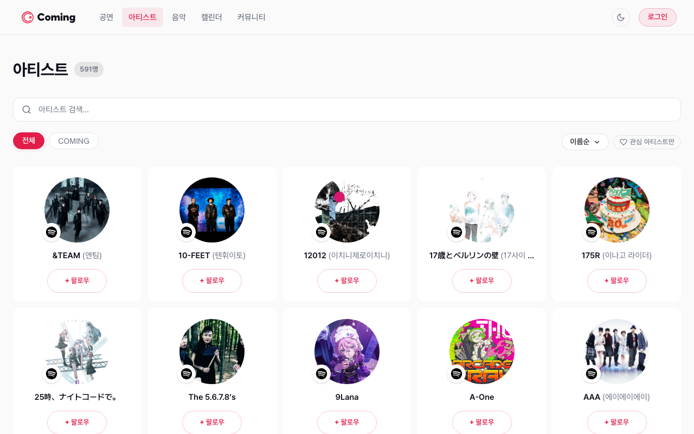
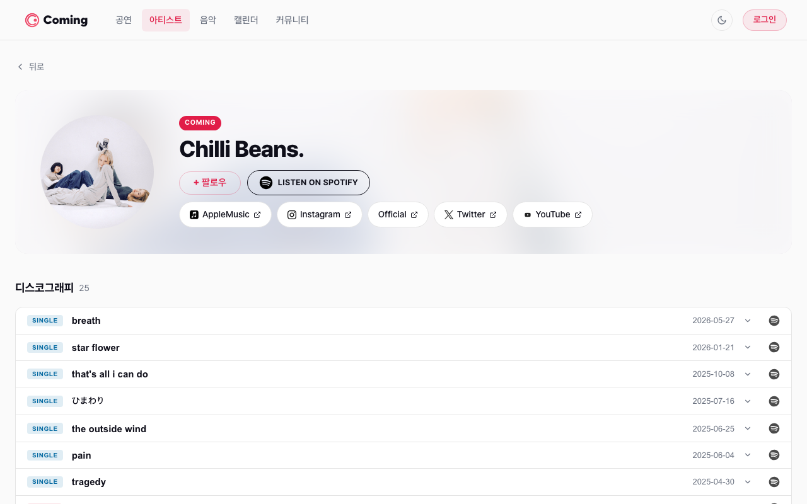
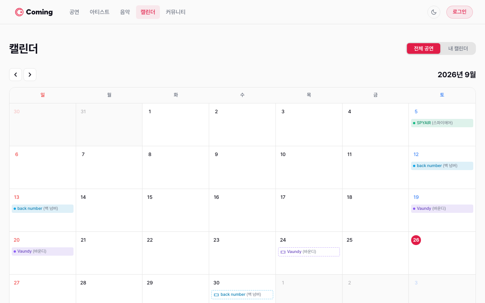
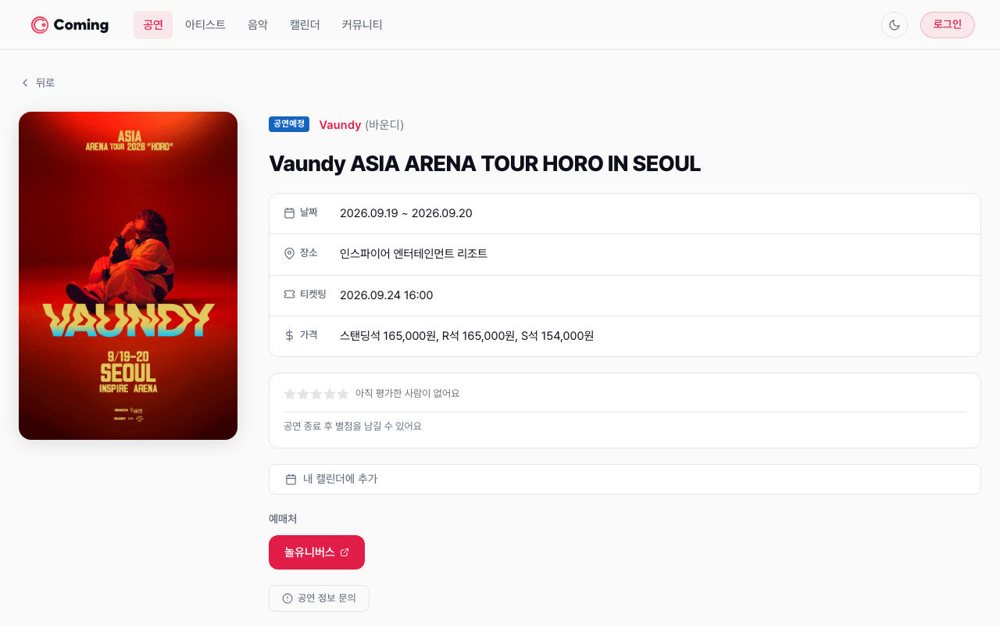
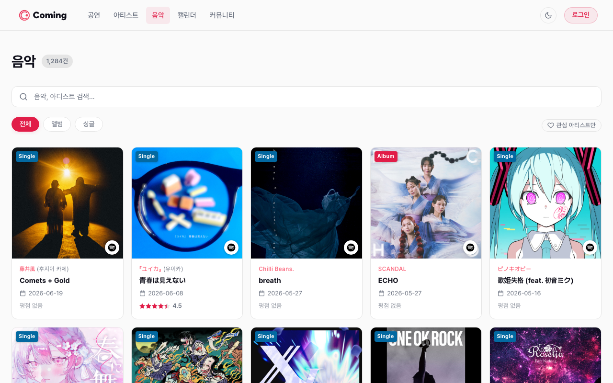
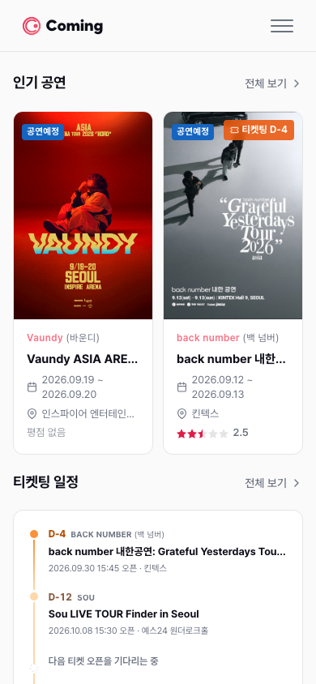
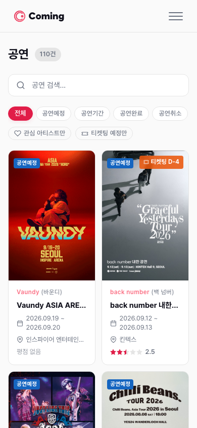

<div align="center">
  

  <br />
  <br />

  **Jpop 아티스트 내한 공연 정보 통합 플랫폼**

  KOPIS · MusicBrainz · setlist.fm 데이터를 연동한 내한 공연 정보 서비스

  <br />

  [](https://react.dev/)
  [](https://vitejs.dev/)
  [](https://tanstack.com/query)
  [](https://zustand-demo.pmnd.rs/)

  <br />

  **[→ comingg.com](https://comingg.com)**

</div>

---

## 서비스 소개

**Coming**은 Jpop 아티스트의 국내 내한 공연 정보를 한눈에 확인할 수 있는 웹 플랫폼입니다.

공연 일정 탐색부터 아티스트 팔로우, 캘린더 뷰까지 — 흩어진 내한 공연 정보를 한 곳에서.

<br />

<div align="center">
  
  <p><sub>홈 — 인기 공연 및 예매 일정 한눈에 보기</sub></p>
</div>

<table>
  <tr>
    <td align="center" width="50%">
      
      <sub><b>공연 목록</b> — 내한 공연 검색 및 필터</sub>
    </td>
    <td align="center" width="50%">
      
      <sub><b>아티스트 목록</b> — 아티스트 탐색 및 팔로우</sub>
    </td>
  </tr>
  <tr>
    <td align="center" width="50%">
      
      <sub><b>아티스트 상세</b> — 다음 내한 D-day · 디스코그래피 · 소셜 링크</sub>
    </td>
    <td align="center" width="50%">
      
      <sub><b>캘린더</b> — 월별 공연 일정 뷰</sub>
    </td>
  </tr>
  <tr>
    <td align="center" width="50%">
      
      <sub><b>공연 상세</b> — 공연 정보 · 장소 · 가격 · 예매처</sub>
    </td>
    <td align="center" width="50%">
      
      <sub><b>음반</b> — 아티스트 음반 릴리즈 목록</sub>
    </td>
  </tr>
</table>

<br />

<details>
<summary>📱 모바일 화면 보기</summary>
<br />
<table>
  <tr>
    <td align="center">
      
      <br /><sub><b>홈</b></sub>
    </td>
    <td align="center">
      
      <br /><sub><b>공연 목록</b></sub>
    </td>
  </tr>
</table>
</details>

---

## 주요 기능

- 🎤 **아티스트** — MusicBrainz 연동 아티스트 프로필, 관련 공연 및 음반 정보
- 🎵 **공연** — KOPIS 기반 내한 공연 목록, 상세 정보 및 출연 아티스트
- 📅 **캘린더** — 월별 공연 일정을 한눈에 확인
- 💿 **음반** — 아티스트 음반 릴리즈 정보 및 setlist.fm 연동
- 🔔 **팔로우** — 관심 아티스트 팔로우 및 마이페이지 관리
- 🔐 **소셜 로그인** — Google · Kakao OAuth 2.0

---

## 페이지 구성

| 페이지 | 경로 | 설명 |
|--------|------|------|
| 홈 | `/` | 메인 페이지 |
| 아티스트 목록 | `/artists` | Jpop 아티스트 목록 및 검색 |
| 아티스트 상세 | `/artists/:id` | 프로필, 관련 공연·음반 |
| 공연 목록 | `/concerts` | 내한 공연 목록 및 필터 |
| 공연 상세 | `/concerts/:id` | 공연 정보, 장소, 출연진 |
| 음반 목록 | `/releases` | 음반 릴리즈 목록 |
| 음반 상세 | `/releases/:id` | 음반 상세 및 수록곡 |
| 캘린더 | `/calendar` | 월별 공연 일정 뷰 |
| 마이페이지 | `/me/*` | 관심 아티스트·공연 관리 _(로그인 필요)_ |
| 관리자 | `/admin/*` | 공연·아티스트 데이터 관리 _(관리자 전용)_ |

---

## 기술 스택

| 분류 | 기술 |
|------|------|
| 프레임워크 | React 19, Vite 8 |
| 라우팅 | React Router v7 |
| 서버 상태 | TanStack Query v5 |
| 클라이언트 상태 | Zustand v5 |
| HTTP 통신 | Axios (인터셉터 중앙화, 자동 토큰 갱신) |
| 스타일 | CSS Modules |
| 날짜 | date-fns, react-datepicker |
| 테스트 | Playwright |

---

## 시작하기

### 요구 사항

- Node.js 20+
- npm 10+

### 설치

```bash
git clone https://github.com/Cominggg/Frontend.git
cd Frontend
npm install
```

### 환경 변수

프로젝트 루트에 `.env` 파일을 생성합니다.

```env
VITE_API_BASE_URL=http://localhost:8080
```

> 개발 서버는 `/api/**` 경로를 자동으로 백엔드로 프록시합니다 (CORS 설정 불필요).

### 개발 서버 실행

```bash
npm run dev
```

`http://localhost:5173` 에서 확인할 수 있습니다.

---

## 명령어

```bash
npm run dev       # 개발 서버 시작
npm run build     # 프로덕션 빌드
npm run preview   # 빌드 결과 미리보기
npm run lint      # ESLint 실행
```

---

## 프로젝트 구조

```
src/
├── pages/              # 라우트 단위 페이지
│   ├── admin/          # 관리자 전용 (AdminRoute 보호)
│   └── ...
├── components/         # 도메인별 컴포넌트
│   ├── artist/         # 아티스트 카드, 별칭, 공연 아이템
│   ├── concert/        # 공연 카드, 아티스트 추가 모달
│   ├── release/        # 음반 카드
│   ├── calendar/       # 캘린더 그리드, 일별 공연 목록
│   ├── auth/           # 로그인 모달
│   ├── layout/         # 헤더, 푸터, PrivateRoute, AdminRoute
│   └── ui/             # 공통 UI (Badge, Pagination, EmptyState 등)
├── services/           # 도메인별 API 함수 (Axios 인스턴스 기반)
├── stores/             # Zustand 스토어 (auth, loginModal, theme)
├── constants/          # 라우트 경로 등 상수
└── utils/
```

---

## 인증 구조

- **소셜 로그인**: Google, Kakao OAuth 2.0
- **Access Token**: Authorization 헤더로 전송
- **Refresh Token**: HttpOnly Cookie로 자동 전송
- **자동 갱신**: 401 응답 시 Axios 인터셉터에서 자동으로 토큰 갱신
- **비로그인 보호**: 보호 기능 접근 시 페이지 이동 없이 로그인 모달 표시

---

## 관련 레포지토리

| 레포 | 설명 |
|------|------|
| [Backend](https://github.com/Cominggg/Backend) | Spring Boot 3.x 백엔드 |
| [Data](https://github.com/Cominggg/Data) | Python 데이터 파이프라인 (KOPIS·MusicBrainz·setlist.fm) |
| [Specification](https://github.com/Cominggg/Specification) | ERD, API 명세, 인증 정책 |
